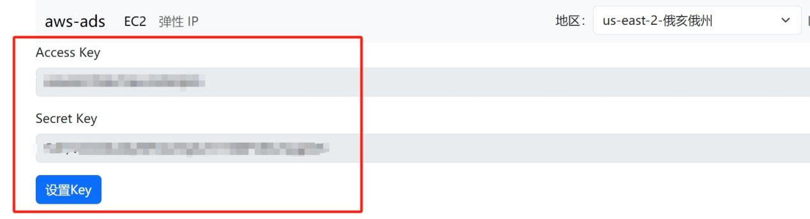
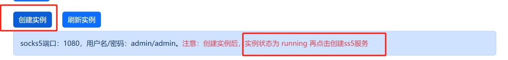
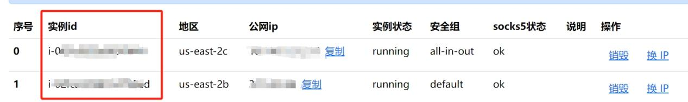

# 创建实例

#### 打开[https://ads.camelshosting.com/](https://ads.camelshosting.com/)网站，注册账号和密码

#### 输入aws的秘钥ID和秘钥key，点击设置KEY

#### 分别在east2、west1、west2三个分区创建一个新的实例，创建实例待实例状态为running后，再点击创建ss5服务

#### 分别记录下三个区的实例id
