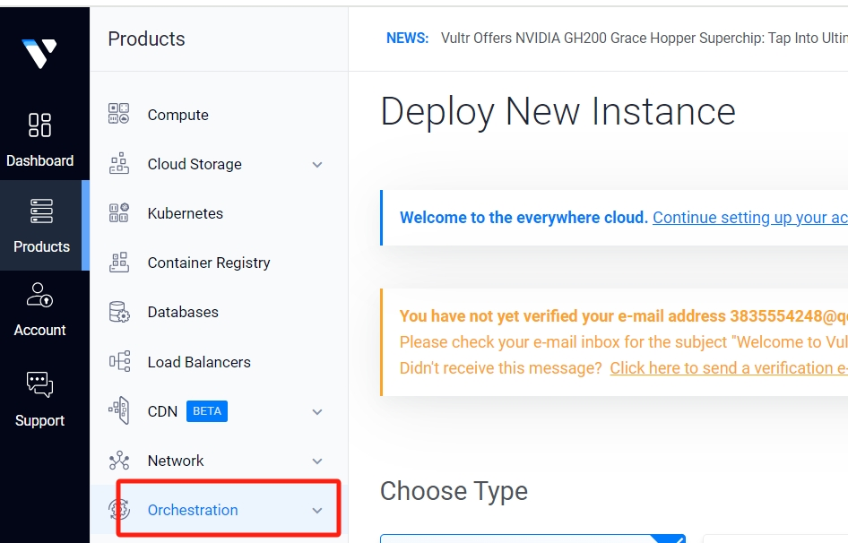
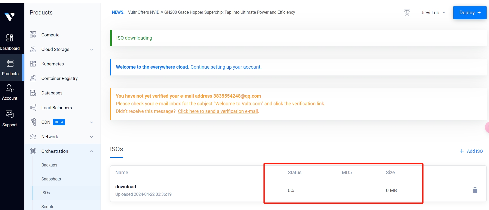

一、打开[https://www.vultr.com/](https://www.vultr.com/)，注册账号和充值，验证邮件

二、打开products-orchestraio-isos功能，选择add iso

随后，在出现需要填写url的地方输入

```
https://onedrive.live.com/download?cid=D39545EBDA3E6859&resid=D39545EBDA3E6859%212455&authkey=!AF0wMULFWQA5ur8
```

耐心等候服务器上传






三、镜像上传好后，创建一个新的服务器

选择第二个shared CPU，服务器地点选择新加坡或者美国都可以


四、choose image选择upload iso选项，点击my isos，勾选下面出现的windows server


服务器规格选择 2h4g


五、additional features选项，**把第一个auto backups 和ipv6全部不勾选**


点击auto backups，在随后出现的对话框里面，勾选I understand the risks，单击delete Autobackup


点击继续，进行服务器的最终创建

六、服务器创建成功后，等待服务器状态变为runnning后，点击服务器，选择view功能


七、随后会出现一个远程桌面，看到这个画面后，选择next


下面这个画面，选择I don’t have a product key


选择列表中第二个操作系统windows server 2022 standard（desktop experience）进行安装，选择后点击next


点击同意协议，下一步


选择第二种安装类型，advanced


选择加载驱动


以下画面选择browse


随后，选择CDdriveD光盘（点击左边的小符号选择），选择VirtIO


随后，再选择viostor——2k19——amd64文件夹


看到这样的选择路径后，选择next


八、下一步，创建远程桌面的密码

User name 不用输入，**密码创建好后一定要牢记，不然所有的程序要重新走一遍，后续操作非常麻烦**


密码创建成功后选择最左边的第一个功能，再点击三个小点，输入刚刚设置的密码


关闭出现的提示框


选择右上方的tools功能，再选择computer management


九、在computer management功能里面，选择device manager，在other device下会看到三个带有问号的unkown device


先选择最后一个unknown device，选择update driver


下一步，选择browse my computer for drivers


随后，也是同样的选择路径，再次选择CD driveD光盘—VirtIO，选择安装


在出现的network提示里，选择yes


这样，刚刚第三个带有问号的unknown device就更新好了，用同样的操作方法，更新第一个和第二个unknown device

九、在远程桌面的左下方，搜索remote


随后打开remote desktop settings


把下面这个功能开启，确认


来到这一步，启动远程桌面就部署好vps了

