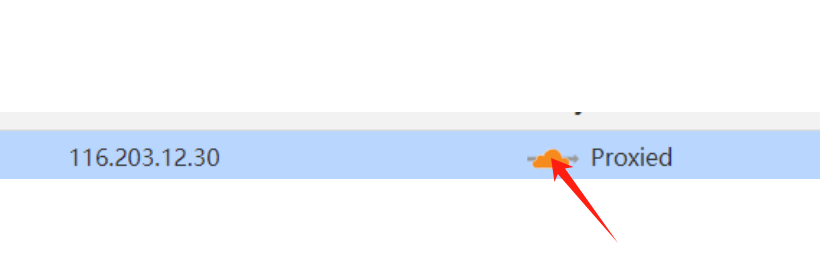
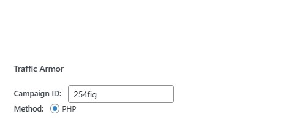
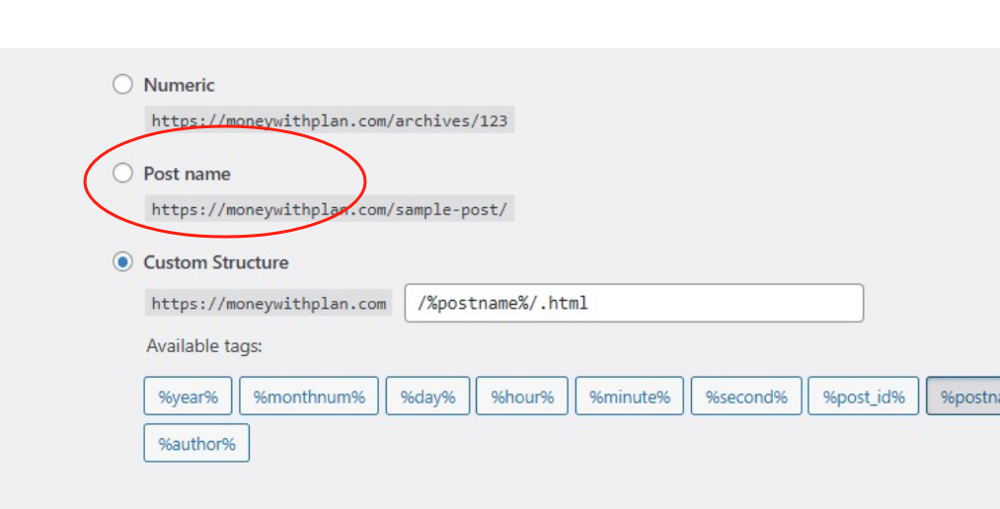
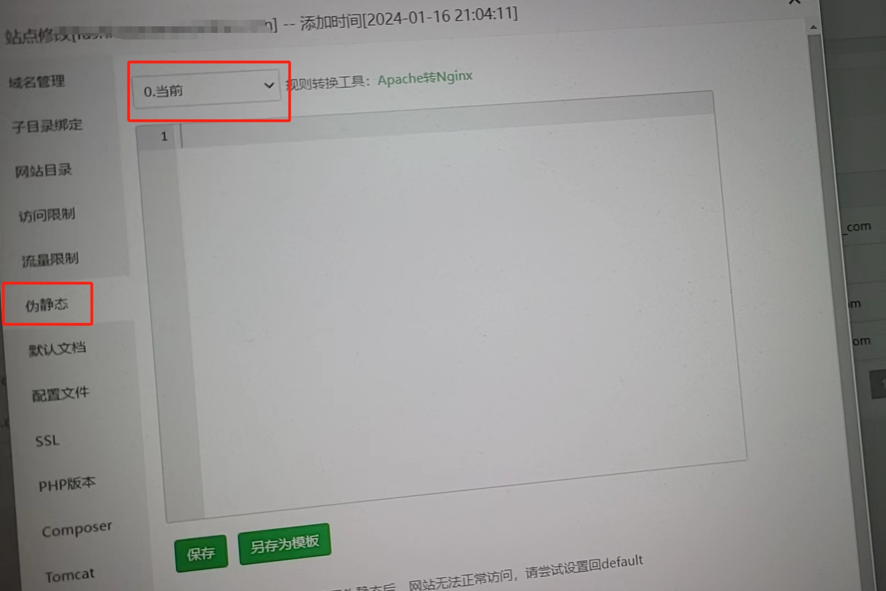

cloak教学

1、先根据offer建立文章或者页面作为landing page，可以先不用太精美细化，后面再修改

2、填写共享表格后发送给我们，campaign id 一栏不填写

3、关闭掉所有的VPN和代理软件，不要使用指纹浏览器

直接访问https://ip125.com/myip，把看到的IP记录下来

4、解析域名

打开网站的域名解析后台（推荐使用cf解析，解析绑定速度更快一些）

新增一条a记录，把网站（track.XX.com）解析到我们发送给你的ip地址

  如果是cloudflare，要把cf 的代理关掉，如下图所示

 5、稍后我们会给你发送两个wordpress安装插件

打开网站wordpress后台，点击插件，上传插件文件进行安装

 6、编辑landing page

打开landing page 界面，点击编辑，文章最底部有一个 campaign id，输入我们发送给你的id，如下图所示

以后你新增offer的时候，把这个campaign id留空，我们创建好给你发送id后，你再填写进去

7、来到wordpress后台的设置——固定链接处，改为post name（如果前期已经设置可以忽略这一步）

如果设置后打开着陆页文章显示404无法打开，检查网站的宝塔后台的伪静态处是否已经打开

如下图所示，把0当前改为wordpress，选择保存

8、填好之后，保存文章，关闭网站，清除网站cookies和网站缓存

随后，关闭VPN、代理、指纹浏览器，直接用本地浏览器访问你的langding page，如果部署成功，会跳转到你的offer界面

9、谷歌投放设置

在投放广告的谷歌CID里，按照文档

https://support.google.com/google-ads/answer/3095550?hl=zh-Hans

将谷歌推广的自动标记功能打开

重要提示：

1、landing page 要做得好看精美一点，因为广告主归因溯源的时候，看到的客户来源都是你的landing page

2、你的整个网站千万不要刷流量

3、后续在谷歌里面创建广告，推广你的着陆页（landing page）就可以了

4、此文档仅内部使用，不可外传